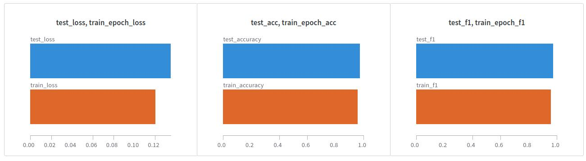

# Trash Classification
## Overview
This repo is a submission for the take-home test as part of the hiring process for the AI Engineer Internship at Adamata. The primary objective of the test is to develop a multiclass classification model capable of categorizing images into one of six classes: cardboard, glass, metal, paper, plastic, or trash.

## Reproducibility
In order to reproduce the code, follow these instructions:

1. Install neccesary library:
    
    ```pip install -r requirements.txt```
2. Edit the environment variable inside `sample.env` and renamed it to `.env`
2. Build the model by running the notebook inside `./model_development/notebook.ipynb`

3. Push the model to huggingface hub:

    ```python deploy_model.py```

## Final Results

Note: For a more detailed breakdown of the results and in-depth analysis, please refer to the notebooks located in `./model_development/notebook.ipynb`

## Demo
The demo can be accessed in [here](https://huggingface.co/spaces/alfiannajih/trash-classification)